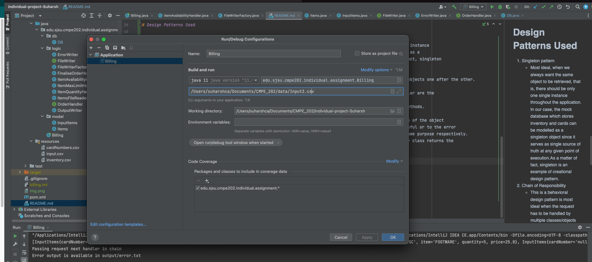
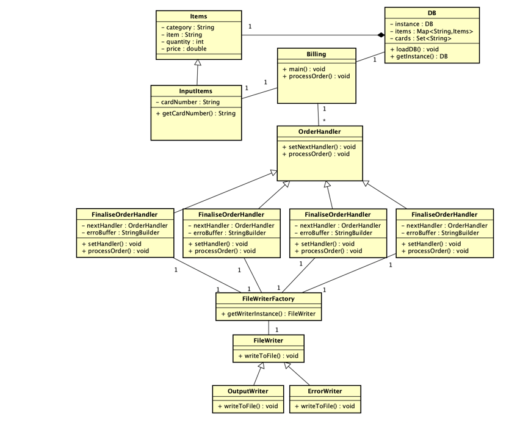
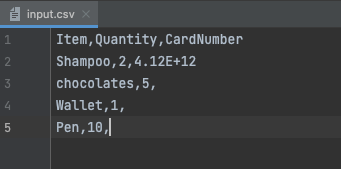
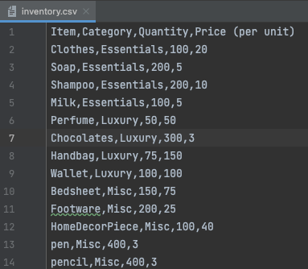
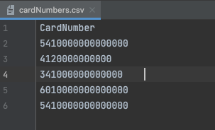
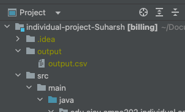
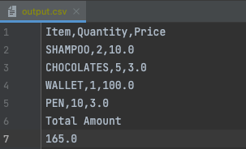

# individual-project-Suharsh
individual-project-Suharsh created by GitHub Classroom

Design and implement a Java application for the following requirements. You may choose up to 3 design patterns. Include a class diagram for your design. All submissions should be committed to the assigned Github repo. Please include a README file with very clear instructions on how to build and run your application.

Please make sure that the name of the main class of your project is 'Billing'

Requirements:

The application should maintain an internal, static database (inventory of stock)  (this may be developed using HashMaps and/or other  built-in Java Data structures). This means once we re-run the program, the changes to the data would not persist. We will provide the data that has to be maintained. The data will contain the following tables and fields:
(Sample input file and sample data set for the inventory would be provided separately)
Table 1: Items
Category (Essentials, Luxury, Miscellaneous)
Item for each category (Essentials - Clothes, soap, milk; Luxury - perfume, chocolates; Misc - Bedsheets, footwear)
The available Quantity of each item
Price of each item
Table 2: Cards
Card Numbers
2. Input CSV file will contain an order including Items, Quantity needed, and the payment card number.
3. Input file should be processed as follows:
   Validate if the requested quantity for each item is permissible. For example, if the request is to order 3 soaps, check the database if we have at least 3 soaps in our inventory.
   There will be a cap on the quantity of each category that can be ordered in one single order. For example, restrict Essentials to a maximum of 3, Luxury to 4, and Misc to 6. (This will be configured beforehand)
   In case it is an incorrect request, generate and output TXT file with message "Please correct quantities." and include the items with incorrect quantities
   After this validation, if the cart is valid, calculate prices for the cart.
   Take the card number of the user and if it is not present in DB add it.
   Output the CSV list with the total amount paid.
   Please refer to the attached file for Inventory, Sample Input and output files. If you cannot proceed with an input transaction for any reasons mentioned above, generate an output TXT with a reason for the same. Sample_Inventory_Input_Output.xlsx  Download Sample_Inventory_Input_Output.xlsx
   What to submit?
   A PDF containing the class diagram of your project and the link to your GIT repo.

# Steps to run the program
* Link to the source code: https://github.com/gopinathsjsu/individual-project-Suharsh.git 
* Java 11 needs to be installed  
* Clone the git repo and open cmd or terminal at the src folder and run the following command
java Billing <input_file_location>
* Output files are generated in the output folder which is outside the src folder
* It will contain output.csv in case the output was successfully generated or error.txt in case there was an error.
* If you are using intellij run the Billing.main() with CLI parameters configured to the path to the input file as shown 
in the example below:

# Design Patterns Used

1. Singleton pattern
   * Most ideal, when we always want the same object to be retrieved, that is, there should be only one single instance
   throughout the application. In our case, the mock database(DB class) which stores inventory and cards can be modelled as a
   singleton since it serves as single source of truth at any given point in time.As a matter of fact, singleton
   is an example of creational design pattern.
2. Chain of Responsibility
   * This is a behavioral design pattern and is most ideal when the request has to be handled by multiple classes/objects one after the other. 
     Each of the classes is part of a "chain of responsibilities".In our case, 
     the following classes: ItemAvailabilityHandler, ItemMaxLimitHandler,ItemQuantityHandler,FinaliseOrderHandler are the 
     classes that process the input request one after the other along the chain. 
    All of these classes implements the interface OrderHandler and overrides the setHandler and processOrder methods.
3. Factory design pattern
   * This is also a creational design pattern where the factory class provides the desired object based on type of the object
   that is requested. In our case, the output can be written to the output file if all transactions are successful or to the error
   file if there is any error in the transactions. The classes OutputWriter and ErrorWriter are used for the same purpose respectively.
   Both these classes implement the interface FileWriter. The getWriterInstance method of the FileWriterFactory class returns the
   instance of ErrorWriter or OutputWriter depending on the type.

# Class diagram

# Sample Input/Output
### input.csv

### inventory.csv

### cardNumbers.csv

### output folder

### output.csv

